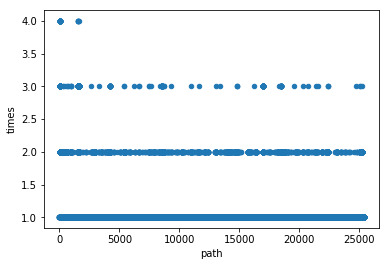

Configuro e creo lo SparkContext:

```python
import findspark
findspark.init("/opt/spark")
from pyspark import SparkConf, SparkContext
from pyspark.sql import SQLContext
from pyspark import sql

conf = SparkConf().setAppName("SO_project").setMaster("spark://damiani-master-slave-0:7077")
sc = SparkContext(conf = conf)
sqlContext = sql.SQLContext(sc)
```

Ottengo i file in hdfs: 
```python
import sh
hdfsdir = '/user/ubuntu/hdfs/dataset'
files = [ line.rsplit(None,1)[-1] for line in sh.hdfs('dfs','-ls',hdfsdir).split('\n') if len(line.rsplit(None,1))][2:]   
```

Voglio solo i primi 4 per poter fare il confronto:

```python
files = files[:4]
for x in files : print x 
```

    /user/ubuntu/hdfs/dataset/03.07.2016.csv
    /user/ubuntu/hdfs/dataset/04.07.2016.csv
    /user/ubuntu/hdfs/dataset/05.07.2016.csv
    /user/ubuntu/hdfs/dataset/06.07.2016.csv


```python
def apply_preprocessing(rdd) :
    '''
    This function applies some transformations in order to have a dataset with this shape: ((plate,path),times)
     - **parameters**, **types**, **return** and **return types**::
          :param rdd: RDD to transform
          :type rdd: pyspark.rdd.RDD
          :return: return the transformed RDD 
          :rtype: pyspark.rdd.RDD
    '''
    header = rdd.first()
    rdd = rdd.filter(lambda lines : lines!=header)
    rdd = rdd.map(lambda lines : lines.split(";")).map(lambda (l1,l2,l3,l4,l5) : (l1,str(l2))).reduceByKey(lambda g1,g2: str(g1)+"-"+str(g2))
    rdd = rdd.map(lambda (plate,path) : ((plate,path),1))
    return rdd 
```


```python
def update(rdd,rdd_new) :
    '''
    Given two RDDs, this function provides a new RDD, which is the union of the RDDs.
    Additionally, the field "times" of the new RDD has been updated. 
     - **parameters**, **types**, **return** and **return types**::
          :param rdd,rdd_new: one of the RDDs to compare
          :type rdd,rdd_new: pyspark.rdd.RDD
          :return: return the new RDD 
          :rtype: pyspark.rdd.RDD
    '''
    result = rdd.union(rdd_new)
    result = result.reduceByKey(lambda a,b : a+b)
    return result
```


```python
def main() :
    rdd_info = sc.textFile(files[0])
    rdd_info = apply_preprocessing(rdd_info)
    
    for file_path in files[1:] : 
        rdd_new = sc.textFile(file_path)
        rdd_new = apply_preprocessing(rdd_new)
        rdd_info = update(rdd_info,rdd_new)
    return rdd_info    
```

Applico le funzioni di preprocessing dei dati: 

```python
%time rdd = main()
```

    CPU times: user 97.3 ms, sys: 25.8 ms, total: 123 ms
    Wall time: 12.4 s


Ottengo un RDD come questo:

```python
rdd.take(5)
```


    [((u'1781733', '22-1-12-14-8-3'), 1),
     ((u'748072', '13-3-8-5-23-18-10-9'), 1),
     ((u'703145', '9-10-18-23-5-8-3-13'), 1),
     ((u'7656964', '16-2'), 1),
     ((u'8530468', '18'), 1)]


Calcolo il numero di percorsi totali per la funzione di hash: 

```python
%time num_path = rdd.map(lambda ((plate,path),times) : (path,1)).keys().distinct().count()
print num_path
```

    CPU times: user 33.2 ms, sys: 11 ms, total: 44.2 ms
    Wall time: 1min 9s
    25375

Funzione di hash:

```python
import sys 

def java_string_hashcode(s):
    h = 0
    for c in s:
        h = (31 * h + ord(c)) & 0xFFFFFFFF
    return ((h + 0x80000000) & 0xFFFFFFFF) - 0x80000000

def get_hash(path) :
    return (java_string_hashcode(path) & sys.maxint) % num_path 
    
```

Apllico la funzione di hash:

```python
%time rdd_final  = rdd.map(lambda ((plate,path),times) : (get_hash(path),times ))
```

    CPU times: user 116 µs, sys: 37 µs, total: 153 µs
    Wall time: 166 µs

Non tengo conto della prima colonna perchè fuorviante per K-means, ottengo quindi: 

```python
rdd_final.take(5)
```


    [(17144, 1), (8076, 1), (12158, 1), (15973, 1), (1575, 1)]


```python
from pyspark.mllib.clustering import KMeans
from numpy import array
from math import sqrt
```
Eseguo il clustering:

```python
%time clusters = KMeans.train(rdd_final,4, maxIterations=3, initializationMode="random")
```

    CPU times: user 18.1 ms, sys: 3.33 ms, total: 21.5 ms
    Wall time: 24 s

Ottengo i centroidi:

```python
for i,center in enumerate(clusters.clusterCenters) :
    print("cluster "+ str(i)+": "+str(center)+"\n")
```

    cluster 0: [1.88692238e+04 1.01121816e+00]
    
    cluster 1: [101.34846719   1.02714477]
    
    cluster 2: [1.99797325e+03 1.01295580e+00]
    
    cluster 3: [9.21424791e+03 1.00905804e+00]
    


```python
def error(point):
    center = clusters.centers[clusters.predict(point)]
    return sqrt(sum([x**2 for x in (point - center)]))

%time WSSSE = rdd_final.map(lambda point: error(point)).reduce(lambda x, y: x + y)
print("Within Set Sum of Squared Error = " + str(WSSSE))
```

    CPU times: user 17.7 ms, sys: 9.86 ms, total: 27.6 ms
    Wall time: 1min 31s
    Within Set Sum of Squared Error = 810316110.429

Stampo i dati:

```python
from pyspark.sql import Row
import pandas

pdf = (rdd_final.map(lambda (path,times) : Row(path=path,times=times))).toDF()
pdf = pdf.toPandas()
pdf.plot(kind='scatter',x ='path',y='times')
plt.show()
```




